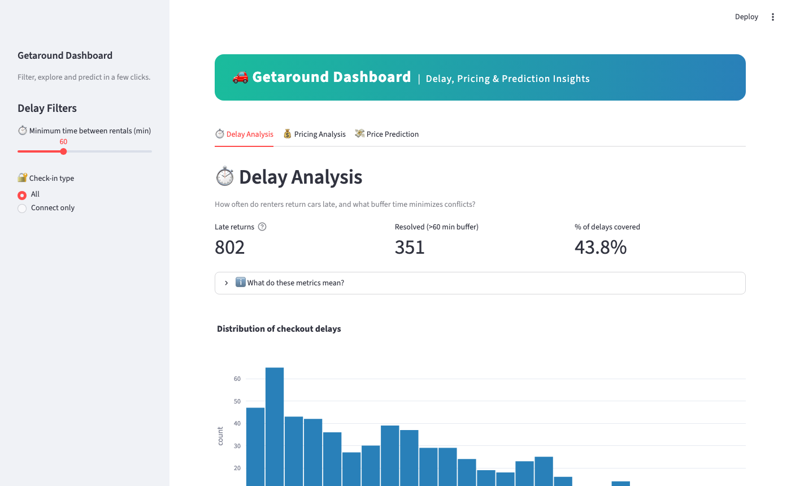

# Getaround — Price Prediction Dashboard & API

A machine learning project built around Getaround car rental data, featuring a price prediction API and an interactive analytics dashboard.



---

## Live Demo

- **Streamlit Dashboard** — [cnoret-getaround-dashboard.hf.space](https://cnoret-getaround-dashboard.hf.space/)
- **FastAPI Prediction API** — [cnoret-getaround-API.hf.space](https://cnoret-getaround-API.hf.space/)

---

## Overview

Getaround owners need to price their cars competitively and minimize conflicts between back-to-back rentals. This project addresses both problems:

- **Delay Analysis**: visualize return delay patterns, simulate buffer time thresholds (e.g. 60 min minimum between rentals), and measure their impact on revenue and conflict resolution.
- **Price Prediction**: given a car's features (mileage, engine power, model, fuel type, options…), predict an optimal daily rental price using a trained Random Forest model.

The project is split into three components:

- **Dashboard** (Streamlit): interactive analytics across two datasets — delays and pricing — plus a prediction form wired to the API.
- **Prediction API** (FastAPI): `POST /predict` endpoint returning a price in euros from car features.
- **Model training** (scikit-learn + MLflow): preprocessing pipeline (StandardScaler + OneHotEncoder) + Random Forest, with MAE/RMSE/R² logged to MLflow.

### Model performance

Evaluated on a 20% holdout set (random_state=42):

| Metric | Value   |
|--------|---------|
| MAE    | 10.68 € |
| RMSE   | 16.73 € |
| R²     | 0.734   |

### Tech stack

- Python 3.10 - FastAPI, Streamlit, scikit-learn, MLflow, pandas, Plotly
- Docker + Docker Compose

---

## Project Structure

```text
.
├── api/                   # FastAPI prediction API
│   ├── main.py
│   └── requirements.txt
├── dashboard/             # Streamlit dashboard
│   ├── app.py
│   └── requirements.txt
├── data/                  # Raw datasets
│   ├── get_around_delay_analysis.csv
│   └── get_around_pricing_project.csv
├── ml/                    # Model training
│   ├── model/
│   │   └── model.joblib
│   ├── model_training.py
│   └── requirements.txt
├── Dockerfile.fastapi
├── Dockerfile.dashboard
├── Dockerfile.training
├── docker-compose.yml
└── README.md
```

---

## Run with Docker (recommended)

```bash
docker compose up --build
```

| Service          | URL                                               |
|------------------|---------------------------------------------------|
| Dashboard        | [localhost:8501](http://localhost:8501)           |
| API + Swagger UI | [localhost:8001/docs](http://localhost:8001/docs) |
| MLflow UI        | [localhost:5001](http://localhost:5001)           |

Docker Compose starts the training first, waits for it to complete, then launches the API and dashboard. Inter-service communication is handled automatically via the `API_URL` environment variable.

---

## Run Locally

### 1. Clone

```bash
git clone https://github.com/cnoret/getaround-ml-dashboard-api.git
cd getaround-ml-dashboard-api
```

### 2. Install dependencies

```bash
python -m venv venv
source venv/bin/activate  # Windows: .\venv\Scripts\activate
pip install -r api/requirements.txt
pip install -r dashboard/requirements.txt
```

### 3. Start the API

```bash
uvicorn api.main:app --reload --host 0.0.0.0 --port 8001
```

Swagger UI: [localhost:8001/docs](http://localhost:8001/docs)

### 4. Start the dashboard

```bash
streamlit run dashboard/app.py --server.port=8501
```

Dashboard: [localhost:8501](http://localhost:8501)

> The dashboard connects to the API via the `API_URL` env var, which defaults to `http://localhost:8001/predict` when not set.

---

## Retrain the model

```bash
pip install -r ml/requirements.txt
python ml/model_training.py
```

Metrics and artifacts are tracked in MLflow (`./mlruns`).

---

## Resources

- [FastAPI](https://fastapi.tiangolo.com/)
- [Streamlit](https://docs.streamlit.io/)
- [scikit-learn](https://scikit-learn.org/)
- [MLflow](https://mlflow.org/)
- [Hugging Face Spaces](https://huggingface.co/spaces)
